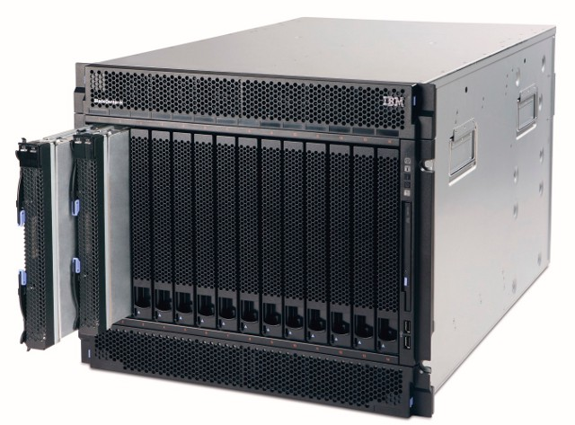

<!-- START doctoc generated TOC please keep comment here to allow auto update -->
<!-- DON'T EDIT THIS SECTION, INSTEAD RE-RUN doctoc TO UPDATE -->


- [Introductions](#introductions)
- [Supercomputers](#supercomputers)
  - [What's this?](#whats-this)
  - [The next generation](#the-next-generation)
- [Sign up for github and the class](#sign-up-for-github-and-the-class)
- [GitHub wiki](#github-wiki)
    - [Your turn](#your-turn)
  - [Homework](#homework)
- [Terminals / shells / command line](#terminals--shells--command-line)
  - [Terminals](#terminals)
  - [Shells / command line](#shells--command-line)
  - [Shell scripts](#shell-scripts)
  - [Note - End of line encoding:](#note---end-of-line-encoding)
  - [For Windows users: WSL2](#for-windows-users-wsl2)

<!-- END doctoc generated TOC please keep comment here to allow auto update -->
<!-- update -->

## Introductions

* [Syllabus](https://github.com/unh-hpc-2023/syllabus/blob/main/README.md)

* Your Instructor

* [Students](Students)

## Supercomputers

### What's this?


Well, that's *fishercat*. fishercat is an IBM PowerXCell 8i (Cell
processor) based cluster that was used for most of this class. It's physicall still upstairs in Morse Hall, but it's essentially ancient.

Okay, so in reality it looks more like three of these in a rack:



### The next generation

* [UNH Celebrates First-in-the-State Supercomputing Capabilities](http://www.unh.edu/unhtoday/2013/11/unh-celebrates-first-state-supercomputing-capabilities)

* [UNH unveiling new Cray supercomputer](http://boston.cbslocal.com/2013/11/03/unh-unveiling-new-cray-supercomputer-slated-for-physics-research/). Trillian was UNH's first Cray.

* UNH's latest supercomputer is also a Cray, called [Marvin](https://plasma-use.sr.unh.edu/pmwiki.php?n=Main.Marvin), which has
  been installed in 2020.

## Sign up for github and the class

* Sign up for [github](https://github.com) (unless you already have a
  github account, then you can just use that).

* Let me know your github user id, so I can add you to the
  "organization" (`unh-hpc-2023`) for this class.

* Sign up for this
  [github classroom](https://classroom.github.com/classrooms/98176993-unh-hpc-2023).

* Sign up for the [class slack](https://join.slack.com/t/unhhpc2023/shared_invite/zt-12ahqsqfm-G_ThK6ico~dsFirkvW1S7Q).

## GitHub wiki

This class, as I've already shown you, uses GitHub to store the class
materials, and we'll use more of GitHub as we go, including me storing
sample code, and you forking it, and using it to store your code
assignments.

Across GitHub, there are a number of places that allow the user to
write simple text with a bit of added mark-up and have it formatted
nicely, e.g., as headlines, or to include code fragments. In
particular, the wiki that comes with the `class` repository has the
class notes stored in that format, which is actually called
`markdown`. `markdown` is one flavor of a lightweight mark-up
language, similar but not the same as used, e.g., on wikipedia, as
this one is more tailored towards coding. An overview of the supported
mark-up is available from
[GitHub](https://guides.github.com/features/mastering-markdown/).

#### Your turn

Pick a page (like this or any other one), and there should be an edit
button near the top. Clicking that will show you the source (which you
can then edit, but you don't necessarily want to save the changes if
you're just playing around, you can use "preview" to just try things
out at first). Take a look how the plain text you're editing relates
to the formatted page that's generated from it.

Create a new page about yourself. To do this, click the "New Page"
button, then use your name as the title and write something. After
saving the page, go the [Students](Students) page, edit it and add
a link to the page you just created.

Eventually, I'd like you to create a page with some information about
yourself (or something else -- whatever you want to share), use some
formatting, and add a picture, but I'll leave that for a first
homework.

### Homework

* Finish signing up for the accounts.

* Create a wiki page about yourself (or your favorite animal / hobby / whatever). Use some markup and add a picture or something.

## Terminals / shells / command line

### Terminals

These days, probably most, if not all, programs you interact with
feature a GUI (graphical user interface) front end. Back in the day,
though, interacting with programs via text only was state of the art,
and this way of working hasn't died yet (and I don't think they will anytime
soon). In fact, people were quite happy about the convenience that
these interfaces brought about, much nicer then carrying a stack of
[punch cards](http://en.wikipedia.org/wiki/Punched_card) to the
machine room.

Initially, the terminals were actual
[teletypewriters(tty's)](http://en.wikipedia.org/wiki/Teletypewriter).
and they are still called this name today in UNIX/Linux. Things became
even better with the introduction of terminals like the
[VT100](http://en.wikipedia.org/wiki/VT100) that used monitors to
display the text. One could even do
[ASCII art](http://en.wikipedia.org/wiki/ASCII_art). We still have a
VT220 terminal over at the RCC (Resarch Computing Center) in Morse
Hall, and use it occasionally, too. Eventually, people started to
build text-based user interfaces (TUI), but those were quickly
superseded by GUIs as we know them today.

### Shells / command line

A shell is a program that takes care of basic interaction with the
user, it provides the command line interface you have already seen.

The primary function of a shell is to run programs, which as simple as
typing the name of the program, followed by options and arguments, if
needed:

```
[kai@mbpro ~]$ whoami
kai
```

Shells also facilitate basic communication between multiple programs. There's a lot of basic commands which can be called from the shell, a very non-exhaustive list:

```
man who ls cd less cp mv rm echo cat tail bg fg jobs kill top grep wc du df sort
```

And other things:
```
. .. ~ dot-files
```

### Shell scripts

Often, it turns out one wants to do the same thing over and over
again. One thing that's actually quite useful is the "cursor up" key,
which will let you go back in your history of commands, so you don't
have to type a command over again. (There's also "CTRL-R", for
searching your history, which can be quite useful, too.)

But if one has a set of commands one needs to repeat often, shell
scripts are useful. Essentially, those are just a text file with a
bunch of commands, and when you run the script, it behaves just as if
you were typing all those commands.


Some real world examples:

This just saves me some typing when configuring my code. More importantly, I'll inevitably have forgotten how I configured it two days later, so that helps having a record of what I did.

```sh
kai@Kais-MacBook-Pro ~/src/psc/build-mac $ cat cmake.sh
CC=mpicc CXX=mpicxx FC=mpifort \
cmake \
    -DCMAKE_PREFIX_PATH=/Users/kai/src/ADIOS2/build-mac/install \
    -DCPM_gtensor_SOURCE=/Users/kai/src/gtensor \
    -DCMAKE_BUILD_TYPE=Debug \
    -DCMAKE_CXX_FLAGS_RELWITHDEBINFO="-g -O2" \
    -DPSC_USE_PERFETTO=OFF \
    -G Ninja \
    ..
```

A little helper script for comparing some data in HDF5 files.

```sh
#! /bin/bash

if [ $# != 3 ]; then
  echo "Usage: h5diff-fld.sh <FILE1> <FILE2> <FLD>"
  exit 1
fi

FILE1=$1
FILE2=$2
FLD=$3

ID1=`h5ls -r $FILE1 | grep $FLD/p0/3d | cut -d ' ' -f 1`
ID2=`h5ls -r $FILE2 | grep $FLD/p0/3d | cut -d ' ' -f 1`
h5diff -p 1e-6 -v $FILE1 $FILE2 $ID1 $ID2
```

You can use scripts to save you typing the same things all over
again. Here's another example: Making a movie, though using a Makefile
instead might be better:

```
#! /bin/bash

FIRST_FRAME=1
LAST_FRAME=119

python lim1.py
for a in `seq $FIRST_FRAME $LAST_FRAME`; do
    python plot.py data_$a.npy data_$a.png
done

ffmpeg -y -r 8 -i data_%d.png -r 30 -pix_fmt yuv420p lim1.mp4

rm -f *.png *.npy
```

A script is essentially just a text file with the commands you want to execute -- and it should start with the first line shown above, which says which shell to use to run the script. Even without that, you can always run a script by saying, e.g., `bash make_movie.sh`. A useful trick for debugging is to call the script with `bash -x make_movie.sh`, which will show the commands as they are executed.

One should mark scripts as executable, so that they can be called like any other program. You can do it by using the `chmod` command:

```sh
[kai@macbook ex_movie (master *)]$ ls -l make_movie.sh
-rw-r--r--  1 kai  staff  234 Jan 29  2021 make_movie.sh
[kai@macbook ex_movie (master *)]$ chmod a+x make_movie.sh
[kai@macbook ex_movie (master *)]$ ls -l make_movie.sh
-rwxr-xr-x  1 kai  staff  234 Jan 29  2021 make_movie.sh
```

I put (or rather, will put) the movie example code into  the syllabus repository: https://github.com/unh-hpc-2023/syllabus.

A nice, and pretty comprehensive, introduction to shells and the
commandline is at http://linuxcommand.org/. You don't need to know all
of this for this class, but learning the basics will help make your
life easier in the future.

### Note - End of line encoding:
If bash scripts edited using windows apps are not producing correct file names or don't work on Linux or WSL2, problem might be due to a difference in character encoding used in windows editors (End of line encoding - EOL: https://en.wikipedia.org/wiki/Newline). In order to fix this just change the EOL encoding from "Windows (CR LF)" to "Unix (LF)" and save the file. It is usually in the bottom corner of the editor screen.
 <!-- (example screenshot - Notepad++). -->

<!-- _**!!Add Nodepad++ Screenshot here**_ -->

### For Windows users: WSL2

I don't really have much experience with Windows Subsystem for Linux
version 2 (WSL2) myself, but in theory it should work fairly well for
what we need in this class. I found a tutorial on how to install WSL2
as a
[write-up](https://medium.com/@japheth.yates/the-complete-wsl2-gui-setup-2582828f4577),
and also a [youtube video](https://www.youtube.com/watch?v=X-DHaQLrBi8) demonstrating how to do it. (Google has many
other links, too).

My recommendation here is to install Ubuntu 20.04 as your linux
distribution, though that's also a fairly arbitrary choice. It's
relatively recent, quite stable, pretty popular, and supported for the long
term. The links above provide a way to install the graphical user
interface (GUI) as well, which I think will be helpful.
